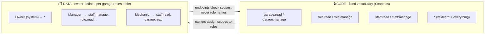
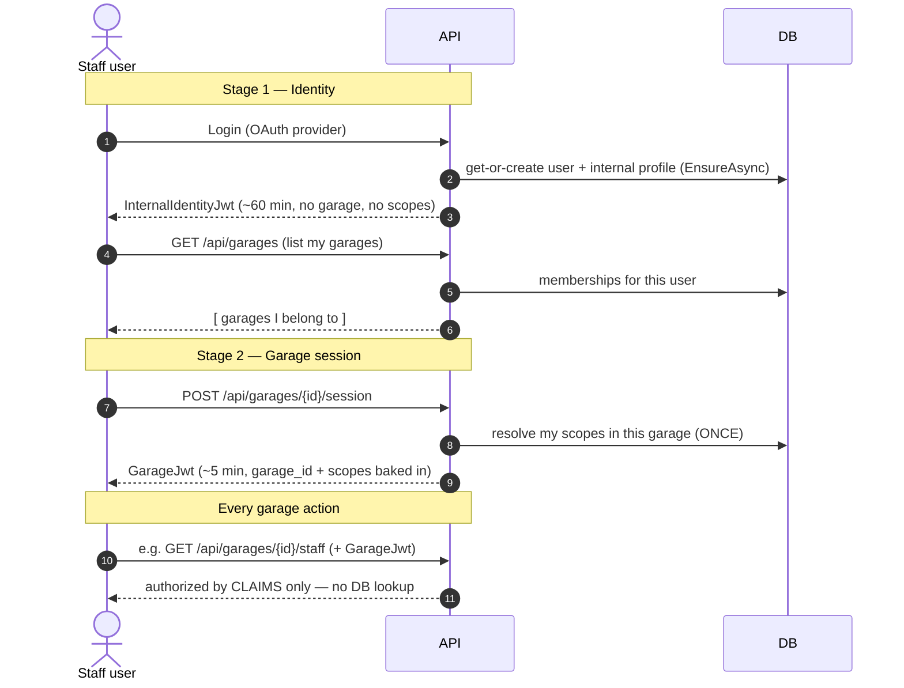
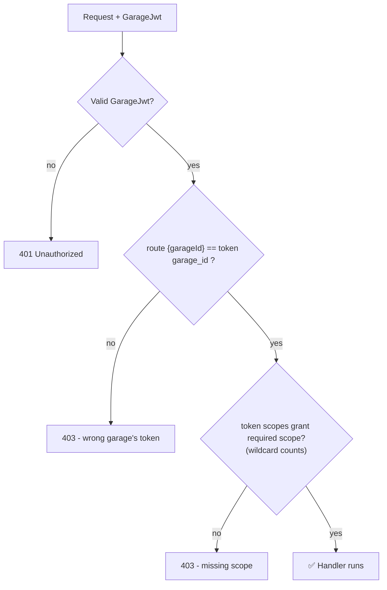
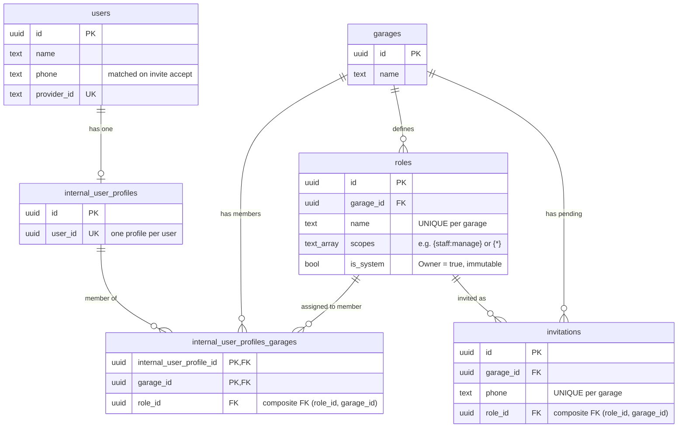
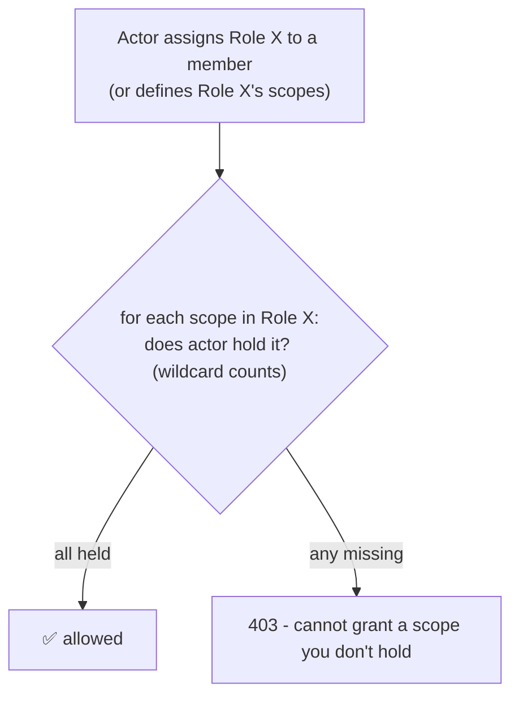

# Per-Garage RBAC — Team Overview

Simple diagrams for presenting the internal-staff authorization model. All
diagrams are [Mermaid](https://mermaid.js.org/) and render in GitHub and VS Code.

---

## 1. The big idea: Scopes are code, Roles are data

We never check role names in code. Code checks **scopes** (a fixed vocabulary).
A **role** is just a garage-owned bundle of scopes that owners edit in the UI.

---

## 2. Two-stage token flow

Login gives an **identity** token (who you are). Opening a garage gives a
short-lived **garage** token (what you can do *in that garage*).

**Why bake scopes into the token?** Authorization becomes a pure claim check —
no DB hit per request. The 5-minute lifetime bounds how long a role change can
be stale.

---

## 3. Request-time authorization pipeline

What `RequireScope(Scope.X)` actually does on every garage-scoped request — all
without touching the database.

> The pipeline verifies the **garage context** and the **scope** only. It does
> NOT check that a `{roleId}`/`{userId}` in the URL belongs to the garage — the
> **service layer** re-checks that.

---

## 4. Endpoint vs Service — separation of duties

```mermaid
flowchart LR
    subgraph EP["Endpoint (thin)"]
        E1["validate DTO shape<br/>(FluentValidation filter)"]
        E2["read actor scopes<br/>from token claim"]
        E3["map exceptions →<br/>404 / 403 / 409"]
    end

    subgraph SVC["Service (unbypassable rules)"]
        G1["Escalation guard<br/>can't grant scopes you lack"]
        G2["System-role immutable<br/>(Owner)"]
        G3["Last-staff-manager guard"]
        G4["Invitation phone match<br/>accept only your own"]
        G5["Cross-garage role isolation"]
    end

    subgraph DBG["Database (defence in depth)"]
        D1["composite FK (role_id, garage_id)"]
        D2["UNIQUE (garage_id, name)"]
        D3["role_id NOT NULL"]
    end

    EP --> SVC --> DBG
```

---

## 5. Data model

Key point: a user can belong to **many garages** and hold a **different role in
each** (the role lives on the membership row, not the user). New members join via
a **phone-number invitation**: a staff manager creates a pending `invitations`
row; the invitee accepts it once signed in (their phone must match), which turns
it into a membership.

---

## 6. The escalation guard (why owners are special)

You can only grant scopes you already hold. Since the wildcard grants everything,
**only an owner can create another owner.**

---

## Cheat sheet

| Concept | Rule |
| --- | --- |
| Permission check | Always `Scope.Grants(...)` — never a role name |
| Identity token | `InternalIdentityJwt`, ~60 min, no garage/scopes |
| Garage token | `GarageJwt`, ~5 min, carries `garage_id` + `scope` |
| Scope resolution | DB read **once** at session mint, baked into token |
| Gate an endpoint | `.RequireScope(Scope.X)` |
| Owner role | system, holds `*`, immutable |
| Grant limit | escalation guard — can't grant what you don't hold |
| Garage lockout | last-staff-manager guard blocks it |
| Invite | phone-number invitation; invitee accepts to join (matched on `users.phone`) |
| Errors | 404 not-found · 403 escalation · 409 conflict |
